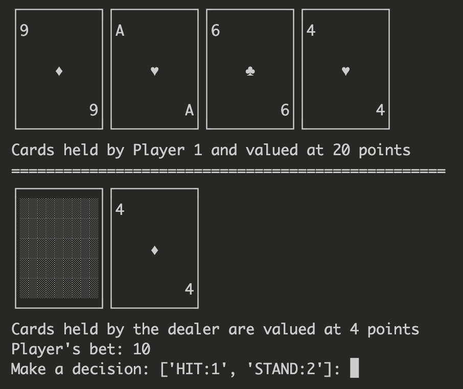

# ♦♠♥♣️ Python CLI Blackjack

## Usage

To play `python3 blackjack.py`.

Run tests with `python3 -m unittest discover test`.

## Features

- [x] Uses beautiful ascii art to display play hand
- [x] Takes bets
- [x] Single-player only
- [x] Constants can be adjusted in `src/config.py` for a different experience

## Future plans

- [ ] Multiplayer mode
- [ ] Expand the amount of possible moves for the player i.e. split, double down
- [ ] Make it even more customizable through the config file
- [ ] Reshuffle the deck when it gets low
- [ ] Use multiple decks
- [ ] Create move suggestion mechanism
